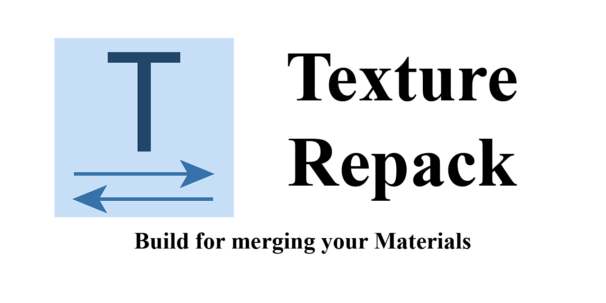

Texture Repack is a small util application (lib / cmd / gui) that allows the repackaging of textures on windows

**Still in development (preview releases) **

The goal of this application / lib is to provide an easy way of merging your textures (material) together. This can be used for example after a substance painter texture export when your mesh contains several materials that would fit into one texture set. (Thats why I have written this lib)

**[Documentation](./docs/index.md)**

## Features

- Loading several types of models from disk
- Creating masks from the models (UV projection)
- Using the masks to merge together textures 

## Current Limitations

- Currently no GUI
- Limited error reporting and handling
- Only 8-Bits per color channel supported (up to R8G8B8A8)

All planed to change in the future

## Information

##### This library / software is using the following Software: 

- DirectX 12, WinApi, Windows Imaging Component, The Windows Shell, potentially other Microsoft and c++ standard libraries

- Actual Installer (for building installer binaries)

- Assimp https://github.com/assimp/assimp ([LICENSE](https://github.com/Ohjurot/TextureRepack/blob/main/vendor/assimp/ASSIMP_LICENSE))

- LUA http://www.lua.org/

  
